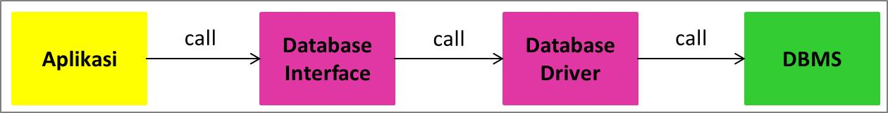
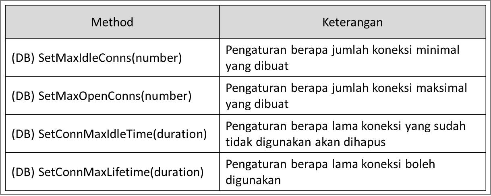
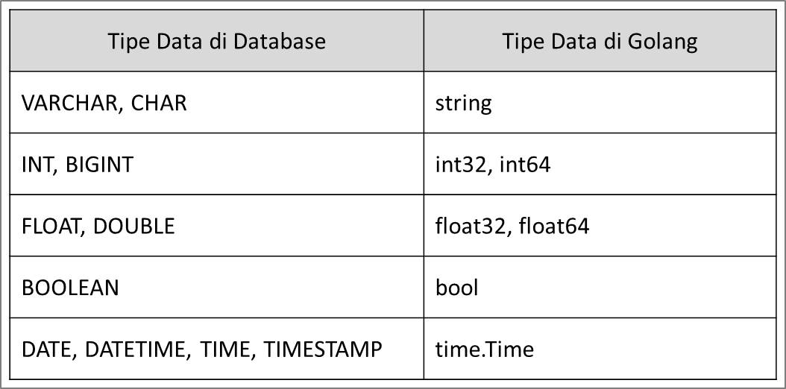
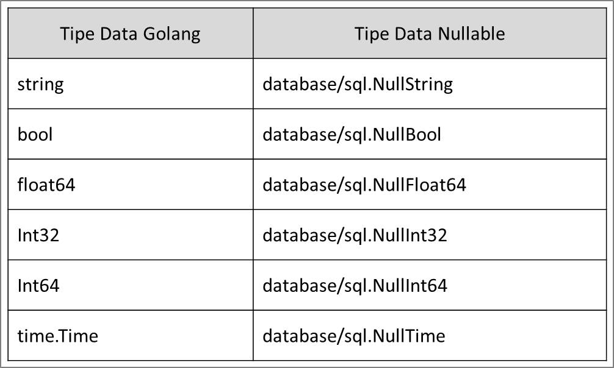

# Golang Database MySQL

## Agenda

- Pengenalan Golang Database
- Package Database
- Membuat Koneksi Database
- Eksekusi Perintah SQL
- SQL Injection
- Prepare Statement
- Database Transaction

## Pengenalan Database

- Bahasa pemrograman Go-Lang secara default memiliki sebuah package bernama `database`
- Package database adalah package yang berisikan kumpulan standard `interface` yang menjadi standard untuk berkomunikasi ke database
- Hal ini menjadikan kode program yang kita buat untuk mengakses jenis database apapun bisa menggunakan kode yang sama
- Yang `berbeda hanya kode SQL` yang perlu kita gunakan sesuai dengan database yang kita gunakan

## Cara Kerja Package Database

- Diagram alir

  

- Database Interface (package database) hanya berisi kontrak, tetap membutuhkan Database Driver
- Database driver nya perlu kita install terlebih dahulu, hanya install library nya saja

## MySQL

- Kita akan menggunakan MySQL sebagai Database Management System

## Menambah Database Driver

- Terlebih dahulu kita wajib menambahkan driver databasenya
- Tanpa driver database, maka package database di Go-Lang tidak mengerti apapun, karena hanya berisi kontrak interface saja
- Menambahkan module database mysql dengan perintah `go get -u github.com/go-sql-driver/mysql`
- harus include dulu driver dari mysql nya di import file go nya, seperti ini `"github.com/go-sql-driver/mysql"`

## Membuat Koneksi ke Database

- Hal pertama yang akan kita lakukan ketika aplikasi yang menggunakan database adalah melakukan koneksi ke databasenya
- Untuk melakukan koneksi ke database di Golang, kita bisa membuat object `sql.DB` menggunakan function `sql.Open(driver, dataSourceName)`
- Untuk menggunakan database MySQL, kita bisa menggunakan driver `"mysql"`
- Sedangkan untuk dataSourceName, tiap database biasanya punya cara penulisan masing-masing. Misalnya di MySQL, kita bisa menggunakan dataSourceName seperti dibawah ini:
  - `username:password@tcp(host:port)/database_name`
- Jika `object sql.DB` sudah tidak digunakan lagi, disarankan untuk menutupnya menggunakan function `Close()`

## Database Pooling

- Object `sql.DB` di Golang sebenarnya bukanlah sebuah koneksi ke database
- Melainkan `sebuah pool` ke database, atau dikenal dengan konsep `Database Pooling`
- Di dalam sql.DB, Golang melakukan management koneksi ke database secara otomatis. Hal ini menjadikan kita tidak perlu melakukan management koneksi database secara manual
- Jadi database pooling ini adalah `kumpulan dari object koneksi`
- Dengan kemampuan database pooling ini, kita bisa menentukan `jumlah minimal dan maksimal koneksi` yang dibuat oleh Golang, sehingga tidak membanjiri koneksi ke database, karena biasanya ada batas maksimal koneksi yang bisa ditangani oleh database yang kita gunakan

## Pengaturan Database Pooling

- Pengaturan database pooling

  

## Eksekusi Perintah SQL

- Saat membuat aplikasi menggunakan database, sudah pastik kita ingin berkomunikasi dengan database menggunakan perintah SQL
- Di Golang juga menyediakan function yang bisa kita gunakan untuk mengirim perintah SQL ke database menggunakan function `(DB) ExecContext(context, sql, params)`
- Ketika mengirim perintah SQL, kita butuh mengirimkan context, dan seperti yang sudah pernah kita pelajari di `Golang Context`. Dengan menggunakan context, kita bisa mengirimkan sinyal cancel, jika kita ingin membatalkan pengiriman perintah SQL nya

## Query SQL

- Untuk operasi SQL yang tidak membutuhkan hasil, kita bisa menggnakan perintah Exec. Namun jika kita membutuhkan `result`, seperti `SELECT SQL`, kita bisa menggunakan function yang berbeda
- Function untuk melakukan query ke database, bisa menggunakan function `(DB) QueryContext(context, sql, params)`

## Rows (Baris)

- Hasil Query function adalah sebuah data structs `sql.Rows`
- Rows digunakan untuk melakukan iterasi terhadap hasil dari query
- Kita bisa menggunakan function `(Rows) Next() (boolean)` untuk melakukan iterasi terhadap data hasil query. Jika return data false, artinya sudah tidak ada data lagi didalam result
- Untuk membaca tiap data, kita bisa menggunakan `(Rows) Scan(columns...)`
- Dan jangan lupa, setelah menggunakan Rows, jangan lupa untuk menutupnya menggunakan `(Rows) Close()`

## Tipe Data Column

- Sebelumnya kita hanya membuat table dengan tipe data di kolom nya berupa VARCHAR
- Untuk VARCHAR di database, biasanya kita gunakan String di Golang
- Bagaimana dengan tipe data yang lain?
- Ada representasinya di Golang, misal tipe data timestamp, date dan lain-lain

## Mapping Tipe Data

- Berikut mapping tipe data dari Golang ke Database

  

## Error Tipe Data Date

- Biasanya golang tidak bisa menerima balikan data dari database dengan tipe data Date

  

- Secara deafult, Driver MySQL untuk Golang akan melakukan query tipe data DATE, DATETIME, TIMESTAMP menjadi `[]byte atau []uint8`. Dimana ini bisa dikonversi menjadi `String`, lalu di parsing menjadi `time.Time`
- Namun, hal ini merepotkan jika dilakukan manual, kita bisa meminta Driver MySQL untuk Golang secara otomatis melakukan parsing dengan menambahkan parameter `parseTime=true`

## Nullable Type

- Golang database tidak mengerti dengan tipe data NULL di database
- Oleh karena itu, khusus untuk kolom yang bisa NULL di database, akan jadi masalah jika kita melakukan Scan secara bulat-bulat menggunakan tipe data representasinya di Golang

## Error Data Null

- Konversi secara otomatis data NULL tidak didukung oleh Driver MySQL Golang
- Oleh karena itu, khusus tipe kolom yang bisa NULL, kita perlu menggunakan tipe data yang ada dalam `package.sql`

  

## SQL Dengan Parameter

- Saat membuat aplikasi, kita tidak mungkin akan melakukan hardcode perintah SQL di kode Golang kita
- Biasanya kita akan menerima input data dari user, lalu membuat perintah SQL dari input user, dan mengirimnya menggunakan perintah SQL
